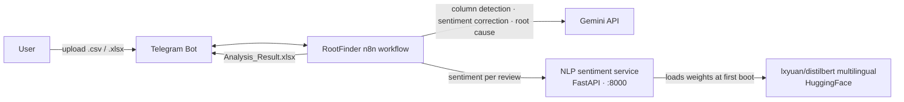

# RootFinder

**AI-powered customer review analysis bot for Telegram.** Upload a `.csv` or `.xlsx` of customer reviews, and RootFinder turns them into a tagged, localized action report.

A **personal portfolio project** built with [n8n](https://n8n.io).

## Try it live

Message [**@raytestmodel3bot**](https://t.me/raytestmodel3bot) on Telegram and upload a `.csv` or `.xlsx` of customer reviews — it will reply with the analysis report.

> Demo instance of a personal project: it may be offline sometimes, has a 250-row upload limit, and AI output can be wrong. See the [Disclaimer](#disclaimer).

## What it does

1. **Receives** a review file (`.csv` / `.xlsx`, max **250 rows**) via Telegram
2. **Auto-detects** your columns — which one is the review text, the star rating, and the ID — using Gemini
3. **Predicts sentiment** per review through a local NLP service
4. **Flags mismatches** between star rating and detected sentiment (sarcasm, misclicks, "5 stars but furious")
5. **Corrects** ambiguous sentiments with Gemini
6. **Extracts root causes** for negative reviews — tags (Pricing, Service Speed, Food Quality, …) + a fix recommendation, written in the review's own language
7. **Returns** `Analysis_Result.xlsx` with everything

**Commands:** `/start` (welcome) · `/sample` (demo files)

## Architecture



Two brains, two jobs:

- **Gemini** (cloud) — the *reasoner*: column mapping, sarcasm/misclick correction, root-cause tagging
- **NLP sentiment service** (self-hosted, included in this repo) — the *fast local scorer*: multilingual `Positive / Negative / Neutral` per review via a distilled DistilBERT fine-tune covering **Indonesian + English** (labels normalized to title case to match the n8n logic)

## Repository layout

```
rootfinder/
├── README.md
├── LICENSE
├── .gitignore
├── workflows/
│   └── RootFinder.json          ← the n8n workflow (import this)
└── nlp-sentiment-service/       ← companion FastAPI container (self-hosted)
    ├── Dockerfile
    ├── docker-compose.yml
    ├── model.py
    └── requirements.txt
```

---

# 🎓 Tutorial: set it up from scratch

Everything you need to run this project on your own machine, step by step. The workflow itself uses only two API keys — a **Telegram bot token** and a **Google Gemini API key** — plus Docker for the local NLP service.

## 1. Get a Telegram bot token (via @BotFather)

1. Open Telegram and start a chat with [**@BotFather**](https://t.me/BotFather) — the official bot that creates bots
2. Send `/newbot`
3. Give it a **name** (shown in chat, e.g. `RootFinder`) and a **username** (must end in `bot`, e.g. `rootfinder_analysis_bot`)
4. BotFather replies with your **HTTP API token** — looks like `8123456789:AAH...`. **Copy and keep it private** — anyone with this token controls your bot

> 🔒 Never commit this token. It lives only in your n8n credentials.

## 2. Get a Gemini API key (via Google AI Studio)

1. Go to [**Google AI Studio**](https://aistudio.google.com/apikey) and sign in with your Google account
2. Click **"Create API key"** (pick a Google Cloud project if asked)
3. Copy the generated key — starts with `AIza...`
4. Google offers a **free tier** with rate limits — enough for testing and light use

> 🔒 Same rule: this key never goes in the repo — only into your n8n credentials.

## 3. Run n8n (skip if you already have it)

RootFinder is an n8n workflow. If you don't run n8n yet, the quickest start is Docker:

```bash
docker network create n8n_default 2>/dev/null || true
docker run -d --name n8n \
  --network n8n_default \
  -p 5678:5678 \
  -v n8n_data:/home/node/.n8n \
  n8nio/n8n
```

Open **http://localhost:5678** and create your account. (The shared `n8n_default` network is what lets the n8n container reach the NLP service by hostname in step 4.)

## 4. Start the NLP sentiment service

The workflow scores each review through a local FastAPI service wrapping [lxyuan/distilbert-base-multilingual-cased-sentiments-student](https://huggingface.co/lxyuan/distilbert-base-multilingual-cased-sentiments-student) (Indonesian + English):

```bash
cd nlp-sentiment-service
docker compose up -d --build
```

> **First boot downloads ~541 MB of model weights** from HuggingFace (not committed to this repo). Later boots reuse the image.
>
> If you run this on a host that already has an `nlp-sentiment-model` container, stop it first or rename the container to avoid a clash.

Verify it's alive:

```bash
curl -X POST http://localhost:8000/predict \
  -H 'Content-Type: application/json' \
  -d '{"inputs": "Terrible food, I am very disappointed"}'
# → [[{"label":"Negative","score":0.81}, ...]]
```

## 5. Import the workflow into n8n

1. In n8n go to the **Workflows** list
2. Click **Import from File** (top right) → select `workflows/RootFinder.json`
   (or open the raw file, copy all text, and use **Import from Clipboard**)
3. Save the workflow once — n8n regenerates its webhook ids

## 6. Connect the credentials

After import, n8n marks two credentials as missing. Click each one and create/attach your own:

| Credential type | Shown as | Fill in with |
|---|---|---|
| `telegramApi` | RootFinder | Your **bot token** from step 1 |
| `googlePalmApi` | Google Gemini(PaLM) Api account | Your **Gemini API key** from step 2 |

In n8n: **Settings → Credentials → Add credential**, search for *Telegram* / *Google Gemini*, paste the key/token, save.

> The exported workflow has **credential ids blanked on purpose** — real keys are never in the repo, and blank ids force n8n to ask for your own.

## 7. Replace the sample files (optional but recommended)

The `/sample` command sends two demo documents using **Telegram file ids that only work with the original bot**. For your bot:

1. Send your two sample files (a review dataset + a finished report) to your own bot
2. Get their `file_id` — forward them to [@RawDataBot](https://t.me/RawDataBot) or call `getUpdates`
3. Paste each id into the `file` field of the **Send Sample Dataset** and **Send Sample Report** nodes (in the `/sample` branch)

## 8. Test it

Send your bot a `.csv`/`.xlsx` (≤ 250 rows) with at least a **review-text column** and a **numeric star column**. You'll get back `Analysis_Result.xlsx` with corrected sentiment + root-cause tags.

---

## Privacy note

Files are processed in-memory and never permanently stored by the bot. This repository is scrubbed for public sharing: instance id, credential ids, webhook ids, and sample file ids have been removed.

## Disclaimer

RootFinder is a **personal portfolio project** — nothing more.

- **No uptime guarantee** — the bot may be offline, change, or disappear at any time.
- **AI makes mistakes** — sentiment and root-cause outputs are best-effort and can be wrong.
- **Not liable** — the author accepts no responsibility for any loss, damage, or claims arising from use of this project or its outputs.
- **No sensitive data** — this repository contains no credentials, keys, or private configuration.

Use at your own risk.
