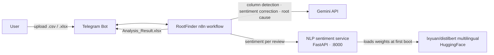

# RootFinder

**Messy customer reviews in → actionable business insights out.**

RootFinder is an AI-powered Telegram bot that turns raw, unstructured customer feedback (Google Maps reviews, surveys, CSVs) into a clean, **localized action report**: each negative review gets root-cause tags and a concrete fix recommendation, written in the reviewer's own language.

A personal portfolio project built with [n8n](https://n8n.io), a self-hosted NLP service, and the Gemini API.

---

## Try it live

Message [**@raytestmodel3bot**](https://t.me/raytestmodel3bot) on Telegram and upload a `.csv` or `.xlsx` of customer reviews — it replies with `Analysis_Result.xlsx`.

> Demo instance of a personal project: it may be offline sometimes, has a 250-row upload limit, and AI output can be wrong. See the [Disclaimer](#disclaimer).

---

## What it does

1. **Receives** a review file (`.csv` / `.xlsx`, max 250 rows) via Telegram
2. **Auto-detects** your columns — review text, star rating, and ID — using Gemini
3. **Scores sentiment** per review (Positive / Negative / Neutral) through a local multilingual NLP service
4. **Flags mismatches** between the star rating and the detected text sentiment (sarcasm, misclicks, "5 stars but furious")
5. **Corrects** ambiguous sentiment with Gemini
6. **Extracts root causes** for negative reviews — up to 3 tags + a summarized problem + a fix recommendation, all in the review's own language
7. **Returns** `Analysis_Result.xlsx` with everything, ready for your team

**Commands:** `/start` (welcome) · `/sample` (demo files)

---

## The core idea: two brains, two jobs

| | **Local NLP service** | **Gemini API** |
|---|---|---|
| Role | Fast, cheap sentiment scorer | Reasoner & language localizer |
| Does | Labels each review Positive/Negative/Neutral (Indonesian + English) | Detects columns, corrects sarcasm/misclicks, extracts root causes |
| Why | Runs every row without cloud cost | Only runs on rows that need judgment |
| Where | Self-hosted, Docker, FastAPI + DistilBERT | Cloud |

The sentiment classifier is deliberately local — it scores all 250 rows in seconds for free. Gemini only gets involved where judgment matters: mapping your columns, fixing star/text contradictions, and writing the root-cause analysis.

---

## Before → After (real data, no cherry-picking)

Here's what the bot does with a real 1-star review from the sample dataset:

| **Input** (raw review, 1★) | **Output** (`Analysis_Result.xlsx`) |
|---|---|
| *"Pelayanan Plongan Plongo, kertas pesanan kecil kita order banyak jadi kita tulis di baliknya jadi admin tidak tau, akhirnya 2 menu kita tunggu lama."* | **Tags:** `Kecepatan Pelayanan` · `Sikap Staf`<br>**Root problem:** "Pelayanan staf sangat lambat dan tidak teliti dalam mencatat pesanan, mengakibatkan makanan datang sangat lama."<br>**Recommendation:** "Berikan pelatihan ulang kepada staf terkait pencatatan pesanan dan tingkatkan efisiensi pelayanan." |

And a few more genuine rows from the same run:

| Input (raw) | Tags | Root problem (localized) |
|---|---|---|
| *"kalo ngerokok di dlm ruangan bisa ga asepnya ditelen aja¿ (yg punya asma mending take away aja)"* | `Suasana` · `Kebijakan` | Pengunjung merokok di dalam ruangan sehingga mengganggu kenyamanan dan kesehatan tamu lain. |
| *"Harga hot sama ice beda. Tapi d tulis ice pdhl lbh mahal ice."* | `Harga` | Informasi harga dan keterangan menu minuman panas serta dingin tidak sesuai. |
| *"Ini tempat udah tutup, tapi di mapnya masih aja statusnya buka."* | `Fasilitas` | Kafe sudah tutup tetapi status di peta daring masih tertulis buka. |

The entire file is processed in one language — the bot detects whether the batch is Indonesian or English, and writes every tag, problem, and recommendation consistently in that language. No mixed-language output.

### Real catches: the mismatch detector in action

The local NLP model is fast, but wording fools it. That's why the star/sentiment detector exists — it catches the model being wrong in **both** directions. Real rows from the pipeline's own run:

| | Review (abridged) | Local NLP | Stars | Detector | Gemini corrected | Reasoning |
|---|---|---|---|---|---|---|
| 🔴 **False Positive** | *"Overall oke, tetapi mohon diperhatikan kebersihan… banyak sekali ulat di tembok, di kamar mandi dll."* | Positive | 1★ | ⚠️ → Gemini | **NEGATIVE** | Pujian kecil di awal, tapi keluhan dominan soal kebersihan & ulat = pengalaman buruk |
| 🟡 **False Negative** | *"Jika pesan di ojol, titiknya di PT Taru Martani… open space jadi sumuk :("* | Negative | 4★ | ⚠️ → Gemini | **NEUTRAL** | Hanya info lokasi + catatan objektif (sumuk), tidak sepenuhnya negatif |

- **Row 1:** the model latched onto the polite *"Overall oke"* opener → called it Positive. But 1★ + a wall of complaints = unhappy. Gemini saw through the opener and flipped it to NEGATIVE.
- **Row 2:** the model saw *"sumuk"* (hot/stuffy) → called it Negative. But the review is mostly informational — 4★ was fair. Gemini downgraded it to NEUTRAL.

The detector never assumes the star rating is right — it just refuses to let contradictory rows pollute the report silently. Rows Gemini settles as Neutral exit without a root-cause row: no action item for a non-complaint.

> Screenshots of the Telegram chat flow and the finished report coming soon.

---

## Architecture



---

## How the pipeline decides (the interesting part)

```
Upload → column detection (Gemini)
       → sentiment score per row (local NLP)
       → Flag Star Sentiment Mismatch
            ├─ False Positive  (≤2★ but text isn't negative)  → Gemini corrects
            ├─ False Negative  (≥4★ but text isn't positive)  → Gemini corrects
            ├─ True Positive   (genuinely happy)              → skipped (no report row)
            └─ True Negative   (genuine complaint)            → root-cause analysis
       → root-cause extraction (Gemini, localized)
       → Analysis_Result.xlsx
```

The star thresholds are designed to be **disjoint** — every review falls into exactly one branch, and "Neutral" text sentiment is handled explicitly (it used to fall through silently). Rows that are genuinely positive exit the pipeline without spending a single Gemini token.

---

## Repository layout

```
rootfinder/
├── README.md
├── LICENSE
├── .gitignore
├── workflows/
│   └── RootFinder.json          ← the n8n workflow (import this)
└── nlp-sentiment-service/       ← companion FastAPI container (self-hosted)
    ├── Dockerfile
    ├── docker-compose.yml
    ├── model.py
    └── requirements.txt
```

---

# 🎓 Tutorial: set it up from scratch

Everything you need to run this project on your own machine, step by step. The workflow itself uses only two API keys — a **Telegram bot token** and a **Google Gemini API key** — plus Docker for the local NLP service.

## 1. Get a Telegram bot token (via @BotFather)

1. Open Telegram and start a chat with [**@BotFather**](https://t.me/BotFather) — the official bot that creates bots
2. Send `/newbot`
3. Give it a **name** (shown in chat, e.g. `RootFinder`) and a **username** (must end in `bot`, e.g. `rootfinder_analysis_bot`)
4. BotFather replies with your **HTTP API token** — looks like `8123456789:AAH...`. **Copy and keep it private** — anyone with this token controls your bot

> 🔒 Never commit this token. It lives only in your n8n credentials.

## 2. Get a Gemini API key (via Google AI Studio)

1. Go to [**Google AI Studio**](https://aistudio.google.com/apikey) and sign in with your Google account
2. Click **"Create API key"** (pick a Google Cloud project if asked)
3. Copy the generated key — starts with `AIza...`
4. Google offers a **free tier** with rate limits — enough for testing and light use

> 🔒 Same rule: this key never goes in the repo — only into your n8n credentials.

## 3. Run n8n (skip if you already have it)

RootFinder is an n8n workflow. If you don't run n8n yet, the quickest start is Docker:

```bash
docker network create n8n_default 2>/dev/null || true
docker run -d --name n8n \
  --network n8n_default \
  -p 5678:5678 \
  -v n8n_data:/home/node/.n8n \
  n8nio/n8n
```

Open **http://localhost:5678** and create your account. (The shared `n8n_default` network is what lets the n8n container reach the NLP service by hostname in step 4.)

## 4. Start the NLP sentiment service

The workflow scores each review through a local FastAPI service wrapping [lxyuan/distilbert-base-multilingual-cased-sentiments-student](https://huggingface.co/lxyuan/distilbert-base-multilingual-cased-sentiments-student) (Indonesian + English):

```bash
cd nlp-sentiment-service
docker compose up -d --build
```

> **First boot downloads ~541 MB of model weights** from HuggingFace (not committed to this repo). Later boots reuse the image.
>
> If you run this on a host that already has an `nlp-sentiment-model` container, stop it first or rename the container to avoid a clash.

Verify it's alive:

```bash
curl -X POST http://localhost:8000/predict \
  -H 'Content-Type: application/json' \
  -d '{"inputs": "Terrible food, I am very disappointed"}'
# → [[{"label":"Negative","score":0.81}, ...]]
```

## 5. Import the workflow into n8n

1. In n8n go to the **Workflows** list
2. Click **Import from File** (top right) → select `workflows/RootFinder.json`
   (or open the raw file, copy all text, and use **Import from Clipboard**)
3. Save the workflow once — n8n regenerates its webhook ids

## 6. Connect the credentials

After import, n8n marks two credentials as missing. Click each one and create/attach your own:

| Credential type | Shown as | Fill in with |
|---|---|---|
| `telegramApi` | RootFinder | Your **bot token** from step 1 |
| `googlePalmApi` | Google Gemini(PaLM) Api account | Your **Gemini API key** from step 2 |

In n8n: **Settings → Credentials → Add credential**, search for *Telegram* / *Google Gemini*, paste the key/token, save.

> The exported workflow has **credential ids blanked on purpose** — real keys are never in the repo, and blank ids force n8n to ask for your own.

## 7. Replace the sample files (optional but recommended)

The `/sample` command sends two demo documents using **Telegram file ids that only work with the original bot**. For your bot:

1. Send your two sample files (a review dataset + a finished report) to your own bot
2. Get their `file_id` — forward them to [@RawDataBot](https://t.me/RawDataBot) or call `getUpdates`
3. Paste each id into the `file` field of the **Send Sample Dataset** and **Send Sample Report** nodes (in the `/sample` branch)

## 8. Test it

Send your bot a `.csv`/`.xlsx` (≤ 250 rows) with at least a **review-text column** and a **numeric star column**. You'll get back `Analysis_Result.xlsx` with corrected sentiment + root-cause tags.

---

## Privacy note

Files are processed in-memory and never permanently stored by the bot. This repository is scrubbed for public sharing: instance id, credential ids, webhook ids, and sample file ids have been removed.

## Disclaimer

RootFinder is a **personal portfolio project** — nothing more.

- **No uptime guarantee** — the bot may be offline, change, or disappear at any time.
- **AI makes mistakes** — sentiment and root-cause outputs are best-effort and can be wrong.
- **Not liable** — the author accepts no responsibility for any loss, damage, or claims arising from use of this project or its outputs.
- **No sensitive data** — this repository contains no credentials, keys, or private configuration.

Use at your own risk.
